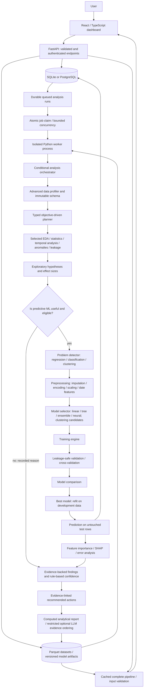

# Implemented architecture

Current maintenance release: **3.0.1**. The Task 1 audit is documented in [TASK_1_AUDIT.md](TASK_1_AUDIT.md); it preserves the existing product architecture and corrects its error, state-transition and analytical contracts.



## Design choices

**One deployable API, separate ML execution.** Training never runs inside an HTTP handler. Development and single-container Docker modes start a dispatcher with the API. The multi-service deployment uses a dedicated worker. Each training job executes in a separate process, and threadpool limits avoid CPU oversubscription.

**Durable state rather than an in-memory task list.** Job status, stages, progress, events, configuration, and result records are persisted. Conditional updates allow only one worker to claim a queued run. Jobs without updates for 30 minutes become failed with an explicit recovery message. Cancellation is cooperative between stages and prevents publication of cancelled artifacts.

**Computed evidence before explanation.** Python calculates every statistic, visualization input, model score, and prediction. The optional LLM receives those results, not unrestricted execution access. Chat and report writing have deterministic fallback implementations.

**Explicit analytical autonomy.** `planner.py` creates a typed plan from objective, profile, schema, temporal information and suitability. `orchestrator.py` executes only selected analyses, records decisions/skips and conditionally reuses AutoML. `statistics.py`, `hypothesis.py`, `time_series.py`, `anomalies.py` and `leakage.py` supply computed evidence. `insights.py`, `confidence.py`, and `recommendations.py` turn evidence into inspectable findings and actions. Descriptive runs have reports and evidence packages without fictional models.

**Restricted optional LLM boundary.** The provider selects IDs of existing computed narrative blocks; it cannot create numerical prose, change metrics or execute code. Invalid IDs, extra fields and provider failures use the deterministic fallback. See `SECURITY.md` for the complete boundary.

**Complete model contracts.** Saved artifacts bundle standard scikit-learn preprocessing and the estimator, plus target-label encoding and typed feature metadata. They can be loaded by the API or used with the exported standalone inference script.

**Usable local defaults.** SQLite WAL and local Parquet/artifact storage keep first-run setup small. The default Docker image serves the built React dashboard and API on port 8080, using SQLite and a persistent `/app/data` volume. The multi-service Compose deployment uses PostgreSQL and a shared artifact volume. Redis, a vector database, and an additional experiment service are not required by the implemented workflow.

**Production frontend delivery.** `STATIC_DIR` enables FastAPI to serve the compiled dashboard from the same origin as the API. Client-side deep links return the dashboard shell, while unknown API routes and missing assets retain proper error responses. Hashed assets have immutable cache headers, HTML requires revalidation, and larger responses are gzip-compressed.

**User-facing workflow.** The dashboard exposes upload, exploration, training, and prediction as clear next steps. A three-step model wizard keeps optional settings separate from the basic goal. The results screen exposes all eleven pipeline stages, separate CV/validation/test evidence, cluster profiles, SHAP contributions, error examples, and the final report. Pages load on demand, and Agentation provides visual-feedback annotation in development.

**Cross-validation and feature engineering.** Classification uses stratified folds, regression/clustering use shuffled folds, and group/time splits use matching fold strategies. Feature engineering and preprocessing are included in each cloned candidate pipeline and fitted inside the fold. Identifiers and high-cardinality free text are excluded. Date fields create year, month, weekday, and cyclic month features; numeric imputation learns missing-value indicators.

Chronological holdouts and CV now keep equal timestamps together. Stable sorting preserves source columns, including names previously used for internal sorting. Actual split sizes can differ from requested proportions at timestamp boundaries. Insufficient date groups produce an explicit split error or recorded separate-validation fallback. Generated date-feature names cannot overwrite source columns.

**Explainability.** Tree and linear winners use dedicated SHAP explainers. Other estimators and clustering use bounded model-agnostic permutation SHAP on numeric transformed inputs; encoded contributions are aggregated to original columns. The method, output units, sample sizes, and any explanation failure are recorded. Cluster ambiguity is reported separately from supervised prediction errors.

## Data entities

| Entity | Stored evidence |
|---|---|
| User | Account name, email, Argon2 password hash |
| Dataset | Ownership, schema/profile, row/column counts, file metadata, SHA-256, Parquet path |
| AnalysisRun | Dataset reference, objective, target, task, configuration, durable state, events |
| Experiment | Owner, name, immutable dataset reference, creation time; run membership in configuration JSON |
| Autonomous result | Typed plan/ML decision, evidence IDs, tests/effects, hypotheses, findings/confidence, recommendations, reproducibility |
| Completed result | Model comparison, test metrics, diagnostics, importance, input schema, exclusions, versions |
| Artifact directory | Complete pipeline, reproducible contract, report, standalone script, ZIP |

Dataset files are immutable after registration. Reuploading creates a new dataset identity. A completed analysis run is the model-version identity in this application.

## Public API

All dataset/run/model endpoints require `Authorization: Bearer <token>`.

### Error contract

HTTP failures use a structured envelope:

```json
{
  "error": {
    "code": "VALIDATION_ERROR",
    "message": "The request contains invalid values.",
    "details": {"issues": [{"loc": ["body", "records"], "msg": "Invalid value", "type": "validation_error"}]}
  },
  "detail": [{"loc": ["body", "records"], "msg": "Invalid value", "type": "validation_error"}]
}
```

`detail` is retained for existing FastAPI clients. Validation details omit submitted inputs/contexts; unexpected failures return a generic message and request ID rather than an exception/traceback. `errors.py` defines safe expected analytical failures such as `INSUFFICIENT_DATA`, `INVALID_SPLIT` and `RESOURCE_LIMIT`. Background failure objects are JSON-encoded inside the existing text column; run responses expose structured `failure` alongside the compatible safe string `error`. Old raw error strings are normalized to a safe rerun message. The frontend `ApiError` retains code/details/status and supports legacy responses.

### Request, job and security boundaries

`security.py` limits consumed ASGI body bytes before JSON/multipart parsing, including requests without Content-Length. General bodies are bounded to 2 MiB; dataset POST bodies permit the configured upload limit plus 2 MiB multipart overhead, and the file itself retains its configured cap. JWTs require subject, expiry and issue-time claims. Owned lookups precede storage/model access; uploaded serialized models are never accepted.

The active-run quota check and insert share a transactional account lock. Parent-run metadata is present before queued work is committed. Cancellation uses a conditional queued/running update; progress, plan updates, failures and publication require `running`, preventing late writes to terminal states. The dispatcher replaces broken pools and retries transient SQL failures. Cancellation remains cooperative at analytical boundaries.

The planner retains its existing deterministic heuristics but honors explicit task contracts: clustering is target-free, explicit supervised tasks retain their outcomes, and numeric classification labels are nominal for statistical tests and excluded from numeric anomaly distances. `version.py` supplies the patch engine identity used in reproducibility hashes. Database tables and artifact schema are unchanged by Task 1.

```text
GET    /api/health
POST   /api/auth/register
POST   /api/auth/login
POST   /api/auth/demo
GET    /api/auth/me
GET    /api/dashboard

GET    /api/datasets
POST   /api/datasets                    multipart file upload
POST   /api/datasets/demo?kind=churn
POST   /api/datasets/demo?kind=temporal
GET    /api/datasets/{id}
GET    /api/datasets/{id}/preview?offset=0&limit=20
GET    /api/datasets/{id}/scatter?x=feature_a&y=feature_b
POST   /api/datasets/{id}/chat
GET    /api/datasets/{id}/quality?target=outcome
DELETE /api/datasets/{id}

POST   /api/analysis-runs
POST   /api/analysis-plans                owned objective/plan preview
GET    /api/analysis-runs
GET    /api/analysis-runs/{id}
POST   /api/analysis-runs/{id}/cancel
GET    /api/analysis-runs/{id}/report
GET    /api/analysis-runs/{id}/download    model or descriptive evidence package
POST   /api/analysis-runs/{id}/rerun

POST   /api/experiments
GET    /api/experiments
GET    /api/experiments/{id}

POST   /api/models/{run_id}/predict
GET    /api/models/{run_id}/download
POST   /api/models/{run_id}/scenario
```

### Analysis request

```json
{
  "dataset_id": "your-dataset-id",
  "objective": "Predict customer churn and explain its main factors",
  "analysis_mode": "autonomous",
  "target": "churn",
  "task": "auto",
  "test_size": 0.2,
  "budget_seconds": 180,
  "split_strategy": "random",
  "split_column": null,
  "cv_folds": 3
}
```

Response: `202 Accepted`, with the run identifier and queued state. Poll the run endpoint for progress and results.

The default `analysis_mode` remains `ml` for backward compatibility. Set `analysis_mode: "autonomous"` to use objective-driven analysis. Optional `experiment_id` groups same-dataset runs; `positive_label` controls the binary positive outcome. Autonomous descriptive results have `task: "descriptive"`, `model_name: null`, and an `analysis` evidence object. The model endpoints reject these runs; analytical report/package endpoints work.

List clients can use `GET /api/analysis-runs?summary=true`; dashboard and experiment views use bounded summary payloads while the owned run-detail endpoint retains complete evidence. Existing run-table columns are preserved. `create_all` adds only the new experiment table; cached profiles upgrade lazily to schema version 4.

### Prediction request

```json
{
  "records": [{
    "tenure_months": 12,
    "monthly_charges": 79.5,
    "support_tickets": 3,
    "usage_gb": null,
    "contract_type": "Monthly",
    "payment_method": "Card"
  }]
}
```

All required feature keys must be present. Missing values may be represented by null and are handled by saved imputers. Numeric values are validated, and unseen categorical values are accepted by the fitted encoder. Probability outputs are raw model probabilities, not a calibration guarantee.

## Performance mechanisms

- Profiling is computed at ingestion and cached in metadata.
- Statistical workloads are bounded to 5,000 rows/24 selected pairs; Isolation Forest to 10,000 rows/12 dimensions.
- Dense ML matrices have an explicit 1,200-input/~512 MiB contract; candidate suitability and skips are recorded.
- Histogram/correlation profiling is bounded to a reproducible 10,000-row sample.
- Scatter visualizations are bounded to 600 points.
- Model-search training is sampled above 20,000 development rows; final refitting uses all development data.
- Worker concurrency is bounded, and numerical library threads are limited per job.
- Prediction pipelines use an eight-entry in-process LRU cache.
- SQL ownership/status columns are indexed; SQLite uses WAL and a busy timeout.
- Frontend query caching deduplicates requests and polls only active workflows.
- Charts and core dependencies are separated in the production build.
- Nginx compresses responses and caches hashed static assets.

These are concrete optimization mechanisms. Actual throughput depends on dataset width/cardinality, model candidates, concurrent workloads, and available CPU/RAM.

The interface adds an objective/plan wizard, analytical findings/evidence/action views, visible trace, data-quality center, experiments/re-run and noncausal scenarios. The original model studio, training wizard, authentication, charts, themes and exports remain usable. See the dedicated autonomous/data-science/statistics/reproducibility documents for decision rules and assumptions.

## Verification and delivery

No CI/CD workflow is checked in. Verification currently uses pytest/Ruff, TypeScript/Vite, Chromium E2E, dependency advisory scans, Docker builds and Compose validation. [VERIFICATION.md](VERIFICATION.md) records executed checks and distinguishes runtime verification from configuration-only checks. The single-container deployment is exercised; PostgreSQL/Nginx multi-service runtime and operational resilience require separate validation.
